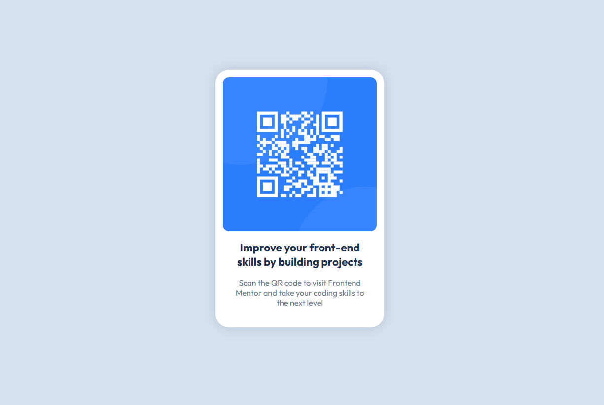

# Frontend Mentor - QR code component solution

This is a solution to the [QR code component challenge on Frontend Mentor](https://www.frontendmentor.io/challenges/qr-code-component-iux_sIO_H). Frontend Mentor challenges help you improve your coding skills by building realistic projects.  

For this project, I have put the css inside the html style tag instead of a separate file because it is pretty simple and small scale. 

## Table of contents

- [Overview](#overview)
  - [Screenshot](#screenshot)
  - [Links](#links)
- [My process](#my-process)
  - [Built with](#built-with)
  - [What I learned](#what-i-learned)
  - [Continued development](#continued-development)
  - [Useful resources](#useful-resources)
- [Author](#author)

## Overview

### Screenshot

### Links

- Solution URL: [Add solution URL here](https://your-solution-url.com)
- Live Site URL: [Add live site URL here](https://your-live-site-url.com)

## My process

### Built with

- HTML5
- CSS
- Flexbox
- Googe Fonts

### What I learned

This project required me to place the whole qr code and text container at the centre of the screen both horizontally and vertically. I achieved this by turning the body into a flexbox and aligning the container.  
  
I also learned how to use google fonts using link tags.

### Continued development

I will try to use alternative units of size apart from 'px' in my future projects and also learn different ways to describe colors.

### Useful resources

The most useful resource for me not only in this project but ever since I started coding has been Google search. It always gives me answers.

## Author

- Github - (https://github.com/Priyanshu-Kumar-Bodra)
- Frontend Mentor - [@Priyanshu-Kumar-Bodra](https://www.frontendmentor.io/profile/Priyanshu-Kumar-Bodra)

